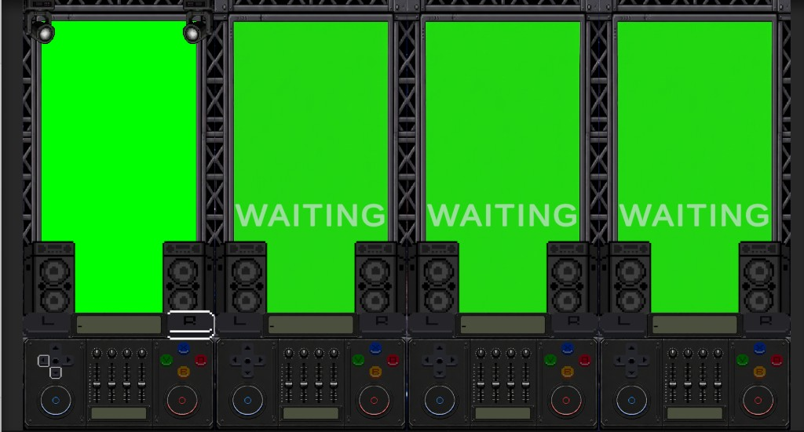
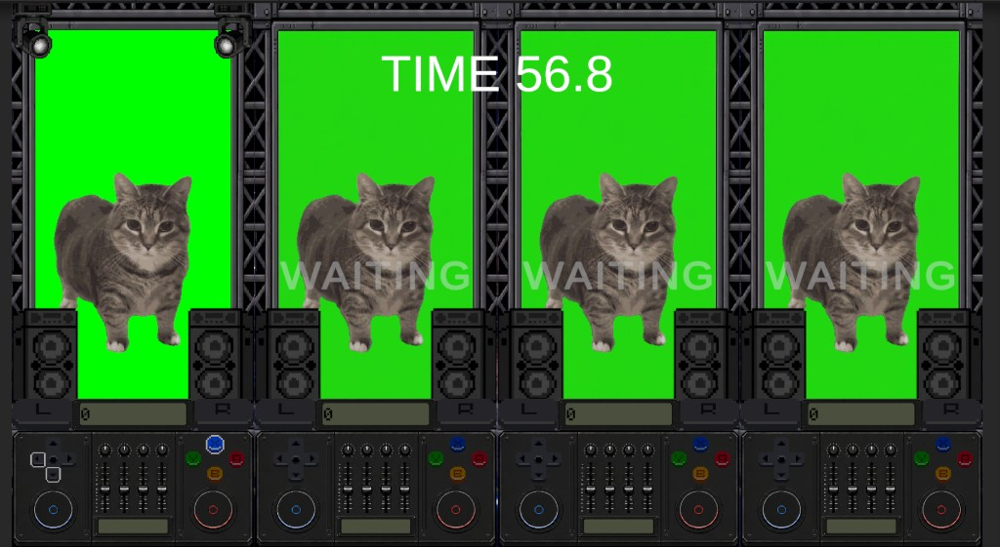
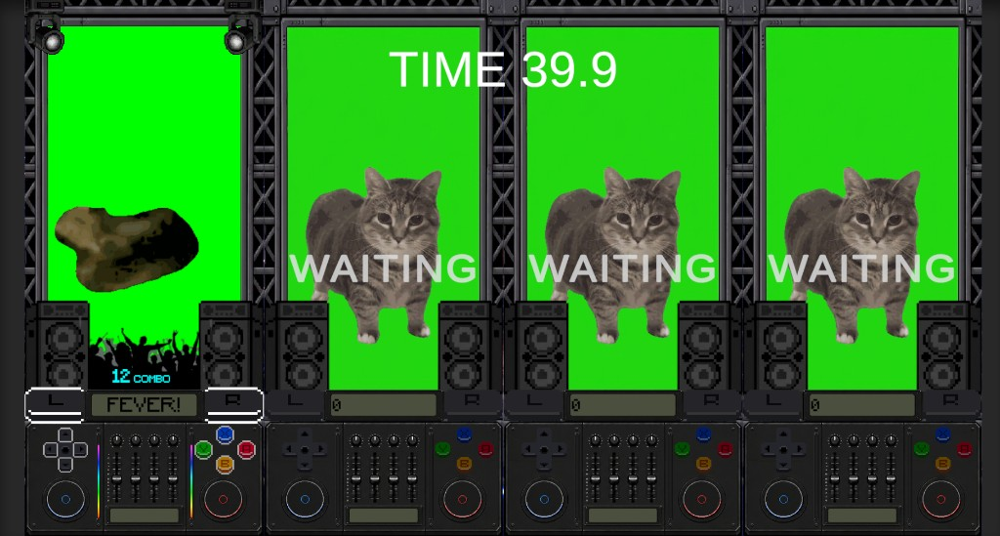
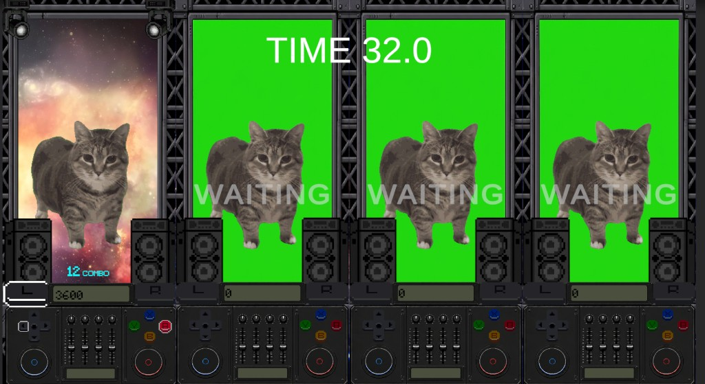
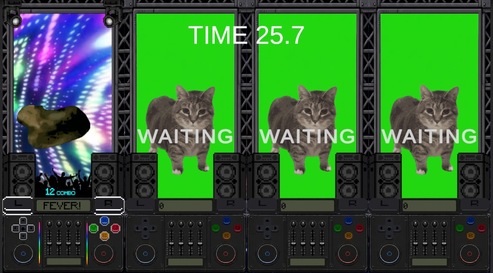

# 05_OIIA

> 문서 기준일: 코드·씬 파일 직접 분석 (추측 없음). **에디터 조작 가이드·플레이 검증 체크리스트는 본 문서에 두지 않는다** (`Project_Master_Context.md` §2·§3). 검증 타임라인은 `02_개발_진행_일지.md`.  
> **갱신**: 2026-07-22 — 스크린샷(연습/T1/T1피버/T2/T3) 기준으로 화면 상태 섹션 갱신. 레거시 서술 제거 완료.

---

## 0. 현재 상태

> **상태**: SNES 10키 디제잉 레이브 · 글로벌 티어 피버 · Scream/떼창/관중/스피커/UiShake **Play 검증 완료** (2026-07-18 기준).

### 한 줄 요약

4명이 세로 4분할 슬롯에서 SNES **10키** 디제잉 박스를 조작한다. 상시 **활성 타겟 3개**를 맞추며 점수를 쌓고, 고정 패턴 `oiiaiooiiiai` 진행·글로벌 시간 티어에 따라 피버·전광판·스포트라이트·연출이 동기화된다.

### 원작 밈 · 글로벌 티어

| 항목 | 값 |
|------|-----|
| BGM | 본게임 시작부터 `mainBgmClip` 단일 루프 |
| T1 | 경과 0–**27**s · **ChromaKey(녹)** · Beam OFF(+15s 예고) · 고양이 Idle |
| T2 | 27–**33.5**s · **Space(우주)** · Beam 상시 OFF(+32s 예고) · 패턴 반복 · 피버 게이지 **0** · 고양이 Idle |
| T3 | 33.5–60s · **Club(클럽 네온)** · Beam ON · **강제 피버** · 고양이 SpinLoop · 관중 |
| Beam 예고 | **15–27**s · **32–33.5**s 흰색 Beam 초고속 점멸 |
| 고양이 | 글로벌 **T3**에서 미스·무입력에도 `SpinLoop` |
| 본게임 길이 | `MainRoundDurationSeconds` = **60** |

### 피버 규칙

| 티어 | 규칙 |
|------|------|
| T1 | `SubPatternMatched == 12` → `BeginFever` · 3초 · **배경 ChromaKey 유지** · 관중·`FEVER!`·Spin |
| T2 | 피버 진입 **없음** · Score 유지 · 우주 배경만 전환 |
| T3 | 강제 피버 · Club 배경 · 관중·`FEVER!`·SpinLoop · 타이머 미소모 · 게이지 **1** |
| 피버 효과 | 10키 전부 Highlight · 모든 입력 정답 · 입력마다 `O→I→I→A…` 수동 진행 |
| Scream | `Scream.mp3` · 피버 슬롯이 하나라도 있으면 루프 · 전부 종료/재시작/세션 종료 시 정지 |
| 떼창 | T1/T3 피버 중 패턴 스텝만 다중 레이어 재생 (`FeverChant.cs`) |
| 관중 | 피버 시 상승·진동·페이드 (`Crowd.cs`) |
| 종료 | T1: 타이머 0 또는 미스 · T3: 라운드 끝까지 유지 |

### 핵심 게임플레이

| 항목 | 값 |
|------|-----|
| 활성 타겟 | `DjActiveTargetCount` = **3** |
| 정답 | `OnDjHit` — Combo++ · Score+`DjHitScore`(**300**) · SubPattern 진행 · Highlight 갱신 |
| 오답 | `OnDjMiss` — Combo=0 · buzz(미연결 시 무음) · 입력 잠금 **0.35s** · 스포트라이트 빨강 플래시 · (비강제피버) 패턴 리셋 |
| 입력 | `DjPadInput.cs` → `BoothUsbSlotInput` |
| Dev God | Backspace — 1P 10키 전부 정답 · 타이머 정지 |

---

## 1. 게임 목적

### 플레이어가 해야 할 일

- DjBox에 **Highlight**된 활성 타겟(최대 3개)을 순서 무관으로 누른다.
- 맞춘 키는 꺼지고, 비활성 키 중 하나가 즉시 보충된다.
- 정답마다 고정 패턴 `oiiaiooiiiai` 진행도가 올라가고(티어별 규칙), 스피커·가이드·SFX가 반응한다.
- 본게임에서는 **60초** 안에 점수를 최대한 쌓는다.

### 승리·실패

- **점수 경쟁**: 종료 후 점수가 높을수록 Result 등수가 높다.
- **한 판 안 오답**: 콤보·패턴 리셋·짧은 입력 잠금. 즉시 탈락 아님.
- **라운드 후 HP** (본게임만, `OiiaHpLossRules`):
  1. 최종 점수 ≤ `HpLowScoreThreshold`(코드 **8000**) 또는
  2. 참가 2명 이상일 때 **하위 50%**(2→1, 3→1, 4→2)
- 해당 시 Result에서 HP −1. HP 0 → GAME OVER (`01_프로젝트_개요.md` 파티·세션 규칙).

### 연습 vs 본게임

| 구분 | 연습 | 본게임 |
|------|------|--------|
| 점수 | `-` | 누적 (`DjHitScore`) |
| 타이머 | **숨김** (스크린샷: TIME 없음) | 중앙 상단 `TIME xx.x` |
| 글로벌 티어 | `ResolveGlobalTier()` 고정 **1** | 경과 시간 기준 T1~T3 |
| 전광판 | ChromaKey | T1 Chroma · T2 Space · T3 Club |
| 고양이 | **숨김** | T1/T2 Idle · T1피버 Spin · T3 SpinLoop |
| HUD | Score 영역 | 비피버 Score · 피버 시 `FEVER!` |
| 관중 | 없음 | T1 피버·T3에서 상승 |
| 스피커·UiShake | 스피커/Shake 스킵 | 활성 |
| READY | START 토글 → 전원 READY 후 운영자 Confirm → 본게임 | — |

---

## 2. 플레이 흐름

```
메인/카탈로그 → Minigame_O.I.I.A.
  └─ OiiaSceneBootstrap.Start
       └─ OiiaMinigameModule.Begin(MinigameContext)

연습:
  Tick → START로 READY 토글
  → 전원 READY + 운영자 Confirm
  → PartySession.PrepareRound(false) → Begin(본게임)

본게임:
  Tick → 시간 감소 · UpdateGlobalTierFeverMode
       → 슬롯별 입력 판정 · 피버 · 연출 · FlushUi
  → 시간 0 / Escape → CompleteSession
       → MinigameExitSequence → Result
```

슬롯 Tick 대략 순서:

```
TickMeta (입력잠금 · TickFever)
  → TickGameplay (활성 타겟 / 전키 정답)
  → CatAnimator · UiShake
  → Spotlight · StageBackground · Speakers · Crowd
  → FlushUi
```

(티어 피버 전환 `UpdateGlobalTierFeverMode`는 슬롯 루프 **앞**에서 호출.)

---

## 3. 화면 구성

### 플레이어 번호 vs 슬롯

- 데이터(HP·점수·참가)는 `PartySession` **플레이어 번호 0~3**.
- OIIA UI는 세로 **4분할** 슬롯으로 보여 준다 (다른 미니게임 배치와 무관).

### 레이아웃

씬 `Minigame_O.I.I.A..unity` · `Panel_O.I.I.A._4Way` 아래 왼쪽부터 SlotPanel_1~4 (앵커 0~0.25 … 0.75~1.0).

```
┌──────────┬──────────┬──────────┬──────────┐
│  슬롯 1P │  슬롯 2P │  슬롯 3P │  슬롯 4P │
│ StageScreen (전광판·고양이·스포트라이트) │
│ Crowd / Speakers / DjBox / HUD         │
└──────────┴──────────┴──────────┴──────────┘
        중앙 상단: TIME (본게임만)
```

슬롯 패널 루트에 `RectMask2D`(`clipSlotContentToPanel`)로 옆 슬롯 오버랩 클리핑.  
비참가 슬롯은 전광판 위에 **`WAITING`** 오버레이.

### 상태별 스크린샷 (1P 참가 · 2~4P WAITING · 2026-07-22)

캡처 경로: `Documentation/images/oiia/`. 아래 표는 **1P 슬롯** 기준 시각 상태.

| 상태 | 파일 | TIME | 전광판 배경 | 고양이 | HUD | 관중 | 비고 |
|------|------|------|-------------|--------|-----|------|------|
| **연습** | `01_practice.png` | 없음 | ChromaKey(녹) | **숨김** | Score/`-` 수준 · FEVER 없음 | 없음 | DjBox·스피커만 보임 |
| **T1** | `02_tier1.png` | 있음 (예: 56.8) | ChromaKey(녹) | Idle(정지) | Score | 없음 | Fixture 스포트라이트 |
| **T1 피버** | `03_tier1_fever.png` | 있음 (예: 39.9) | ChromaKey(**유지**) | Spin | **`FEVER!`** · Combo | **있음** | 배경은 T1 크로마키 유지 |
| **T2** | `04_tier2.png` | 있음 (예: 32.0) | **Space**(우주) | Idle | Score · Combo | 없음 | 피버 진입 없음 |
| **T3** | `05_tier3.png` | 있음 (예: 25.7) | **Club**(클럽 네온) | SpinLoop | **`FEVER!`** · Combo | **있음** | 강제 피버 · L/R 등 전키 Highlight 가능 |

#### 연습



#### T1 (비피버)



#### T1 피버



#### T2



#### T3 (강제 피버)



### 슬롯 패널 구조 (`OiiaSlotPanel` · AutoWire 이름)

| 이름 | 역할 |
|------|------|
| `StageScreen` | 전광판 루트 · Bg_ChromaKey / Bg_Space / Bg_Club · Cat · SpotlightL/R |
| `DjBox` | 디제잉 박스 · HudDisplay(Score/Fever) · Combo · FeverGauge×2 · SubPatternGuide · Speakers · Crowd |
| `SpeakerL` / `SpeakerR` | Body · WooferTop · WooferBottom (스크린샷 L/R 캐비닛) |
| `Crowd` / `CrowdPeople` | 피버 관중 실루엣 (T1 피버·T3) |
| `Ready` / `Waiting` | 연습 READY · 비참가 WAITING |
| 슬롯 배경 Image | `SlotPanelBackgroundImage` |

---

## 4. UI 바인딩 (`SlotUiBindings` / `OiiaSlotPanelBindings`)

| 필드 | 역할 |
|------|------|
| `PracticeReadyText` · `WaitingText` · `SlotPanelBackgroundImage` · `CatAnimator` | 공통 |
| `DjBoxRoot` · Face/Dpad/Shoulder · `DjPadButtons[10]` | SNES 10키 |
| `HudScoreText` · `HudFeverText` | Score ↔ FEVER! 상호 배타 |
| `HudComboText` | `{n}<size=55%> COMBO</size>` |
| `FeverGaugeImage` · `FeverGaugeImageB` | 피버 게이지 Filled ×2 (프리팹명 `FeverGauge_L` / `FeverGauge_R` 가능) |
| `SubPatternGuideText` | `oiiaiooiiiai` 맞춘 접두 대문자만 |
| `SpeakerL/R` Root·Body·WooferTop·WooferBottom | 스피커 |
| `StageScreenRoot` · StageBackground Chroma/Space/Club | 전광판 |
| `CrowdRoot` · `CrowdImage` | 관중 |
| `SpotlightL/R` Root·Fixture·Beam | 스포트라이트 |

---

## 5. 입력

### 디제잉 10키 (`OiiaDjPadButtonId`)

| Id | 부스 경로 |
|----|-----------|
| A/B/Y | Face A/B/Y |
| X | Primary Trigger |
| L/R | Shoulder L/R |
| Up/Down/Left/Right | Stick 방향 |

### 운영자·기타

| 입력 | 동작 |
|------|------|
| 슬롯 START | 연습 READY 토글 |
| 운영자 Confirm | 전원 READY 시 본게임 전환 |
| Escape | 세션 조기 종료 |
| Backspace | Dev God Mode (1P) |

무시: 입력 잠금 중 · 연습 READY 중 해당 슬롯 · EMPTY 슬롯.

---

## 6. 게임 규칙

### 활성 타겟

1. 시작 시 랜덤 3키 Highlight.
2. 활성 키 정답 → 해당 키 OFF · 비활성 중 1개 즉시 보충.
3. 비활성 키 입력 → 미스.
4. 피버/Dev God → 전 키 정답·Highlight 유지.

### SubPattern `oiiaiooiiiai`

| 상황 | 동작 |
|------|------|
| T1 비피버 | 정답마다 +1 · 12 완성 → 3초 피버(진행도 0) · 마지막 글자 SFX는 `steppedPosition` 반환으로 보장 |
| T2 | 피버 없음 · 1~12 순환 · 게이지 0 |
| T1/T3 피버 | 입력마다 1~12 순환 · 가이드·스피커·스텝 SFX(떼창) |
| 미스(강제피버 제외) | 진행도 0 · (T1 피버면 EndFever) |

### 연출 요약

| 시스템 | 트리거·동작 |
|--------|-------------|
| UiShake | 정답 임펄스 `uiShakeTier*` + 상시 `uiShakeIdle*` · 대상 HUD·DjBox·StageScreen |
| Speakers | 패턴 스텝 → 우퍼 펄스 · O/I/A 글자 분출 · `speakerTier1/2/3` |
| Spotlight | Fixture 상시 · Beam T3/예고/피버 · 오답 빨강 플래시 |
| StageBackground | T1 **Chroma**(피버 중에도 유지) · T2 **Space** · T3 **Club** 크로스페이드 |
| Crowd | 피버 Rising→Active(진동)→Fading |
| CatAnimator | 정답 SpinOnce · T1 피버 중 Spin · **T3** SpinLoop(상시) |
| Slot clip | 패널 `RectMask2D` |

---

## 7. 점수

| 이벤트 | 점수 |
|--------|------|
| 정답 1회 (`OnDjHit`) | **+300** (`DjHitScore` = `Tier1ScorePerChar`) |
| 오답 | 점수 차감 **없음** (콤보·패턴만 리셋) |
| 연습 | 점수 미가산 |

`Balance.cs`의 티어별 글자점수·루프보너스·게이지 드레인 헬퍼는 **현재 디제잉 판정 경로에서 미사용**(레거시 잔존).

---

## 8. 오디오

| 채널 | 동작 |
|------|------|
| `mainBgmClip` | 본게임 단일 루프 (`TierBgm.cs` · `tierBgmVolume`) |
| `patternStepSfx[12]` | 일반: `sfxSource.PlayOneShot` · 피버: `PlayFeverChantStep` |
| FeverChant | 원본 레이어 + 피치/볼륨/지연 분산 레이어 · 풀 런타임 생성 |
| `feverScreamClip` | 피버 중 루프 · 전용 AudioSource |
| `buzzClip` · `sessionEndClip` | 씬 **미연결**(의도적 가능) |

---

## 9. 코드 구조

### 진입

| 파일 | 역할 |
|------|------|
| `OiiaSceneBootstrap.cs` | PartySession → `Begin` / `Tick` |
| `OiiaMinigameModule.cs` | `IMinigameModule` · `BuiltInId = "oiia"` |
| `OiiaSlotPanelBindings.cs` | 프리팹 AutoWire → `SlotUiBindings` |

### partial (`OiiaMinigameModule.*`)

| 파일 | 역할 |
|------|------|
| `Begin` / `Tick` / `ExitSequence` | 수명주기 |
| `PracticeFlow` | READY · 본게임 전환 |
| `Gameplay` / `DjPadInput` / `DjPadVisual` | 판정·입력·L/R·ABXY Unpressed |
| `Fever` / `FeverAudio` / `FeverChant` | 피버·Scream·떼창 |
| `SubPatternGuide` | 패턴 진행·가이드 UI |
| `Speakers` / `Crowd` / `UiShake` | 연출 |
| `Spotlight` / `StageBackground` / `CatAnimator` | 전광판·조명·고양이 |
| `TierBgm` / `PatternAudio` | BGM·스텝 SFX |
| `Ui` / `SlotPanels` / `SlotEmptyUi` / `SlotHelpers` | UI·클리핑 |
| `GlobalTier` / `Timer` / `Balance` / `Constants` / `Types` / `Config` / `State` / `DevGodMode` | 공통 |

### 기타

| 파일 | 역할 |
|------|------|
| `OiiaHpLossRules.cs` | Result HP 감소 대상 |
| `OiiaResultMinigameFlavor.cs` | Result ID 매칭만 (장식 미구현) |
| `OiiaVideoEffectController.cs` | 크로마키 MP4 유틸 · **모듈에서 미호출(고아)** · 정리 후보 |

### 제거된 레거시 (문서·코드 기준)

BurstText · ShuffleEffect · ButtonShuffle · GuideFeedback · GaugeSlider 드레인 룰 · SequenceText 커서 입력 · BlurFx · CatMovement · OiiaPhysicalButton MapO/I/A.

---

## 10. 씬

- 씬: `Assets/Scenes/Minigame_O.I.I.A..unity`
- 모듈 루트 예: `O.I.I.A._Root` + `OiiaMinigameModule` + `OiiaSceneBootstrap` + AudioSource
- 컨테이너: `Panel_O.I.I.A._4Way` → 슬롯 패널 4 · `FadeOverlay` · `Timer`

---

## 11. Inspector (`Minigame_O.I.I.A.` 씬 튜닝 · 2026-07-18)

### 핵심 연결

| 필드 | 씬 |
|------|-----|
| `displayName` | OIIA |
| `mainRoundTimerCentralTop` | Timer 연결 |
| `slotPanels[4]` · `slotPanelsContainer` | 연결 · `clipSlotContentToPanel` ON |
| `sfxSource` | 동일 GO AudioSource |
| `mainBgmClip` | 연결 |
| `patternStepSfx` | **12**개 연결 |
| `feverScreamClip` | `Scream.mp3` · Source 런타임 |
| `buzzClip` · `sessionEndClip` | **비어 있음** |
| `speakerLetterTemplate` | 연결 |
| `exitScreenFader` | FadeOverlay |

### 튜닝 수치 (씬)

| 그룹 | 값 |
|------|-----|
| UiShake Hit T1/T2/T3 | OFF · **8/1s/5Hz** · **20/0.25s/64Hz** |
| UiShake Idle T1/T2/T3 | OFF · **10px/1Hz** · **8px/32Hz** |
| FeverChant | Layer **12** · Pool **32** · Pitch **0.98~1.02** · Vol **0.5~1** · Delay **0.15s** |
| Crowd | Rise 120 · Rise/Fade 0.35/0.4 · Shake Amp **10** · Freq **3** · AutoPlace **OFF** |
| Speaker T1 | Pulse 1.2/0.1 · Dur 0.5 · Size 50 · Fly 50 · Shake 5/10 · Scale 0→1 |
| Speaker T2 | Pulse 1.2/0.3 · Dur 1 · Size 80 · Fly 100 · Shake 0 · Scale 0→1 |
| Speaker T3 | Pulse 2/0.1 · Dur 0.5 · Size 100 · Fly 200 · Shake 20/40 · Scale 0→2 |
| Spotlight | `spotlightBeamAlpha` **0.15** |
| Stage BG | `stageBgCrossfadeSeconds` **0.4** |
| DjPad | ABXY Unpressed 명도 **100** · L/R Highlight black 스프라이트 연결 |
| BGM | `tierBgmVolume` **0.85** · `tierBgmSource` 비움(런타임 생성) |
| Cat | Idle / SpinOnce / SpinLoop |

코드 상수: `MainRoundDurationSeconds` **60** · `DjHitScore` **300** · `FeverDurationSeconds` **3** · `InputLockAfterMissSeconds` **0.35** · HP 컷 **8000**.

---

## 12. 데이터 흐름

### 정답

```
CollectDjPadPressed → OnDjHit
  → Combo++ · AdvanceSubPatternOnHit → steppedPosition
  → Score += 300 (본게임)
  → Cat SpinOnce · UiShake · Speakers(Notify)
  → PlayPatternStepSfx(steppedPosition, feverChant?)
  → (T1 & matched==12) BeginFever → Crowd · Scream
```

### 오답

```
OnDjMiss → Combo=0 · InputLock 0.35s · buzz
  → EndFever 또는 ResetSubPattern · Spotlight 빨강
```

### 연습 → 본게임

```
START → READY · Confirm → PrepareRound(false) → Begin(본게임 ctx)
```

---

## 13. Result 연동

| 항목 | 내용 |
|------|------|
| Report | `MinigameId = "oiia"` · `FinalScore` · `HpLostThisSession` |
| HP | `OiiaHpLossRules.FillHpLost` |
| Flavor | `OiiaResultMinigameFlavor` — ID 매칭만 |

---

## 14. 구현 진행도

### 완료

- 10키 디제잉 · 활성 타겟 3 · 연습/본게임 · 타이머 · Result/HP
- 글로벌 티어 배경·Beam·고양이 · T1/T2/T3 피버 규칙
- SubPatternGuide · Speakers · Crowd · UiShake · Scream · FeverChant
- 슬롯 RectMask2D 클리핑 · ABXY Unpressed 명도

### 미완·후속

- 2~4P·부스 다패드 재검증
- `OiiaResultMinigameFlavor` 전용 비주얼
- `buzzClip` / `sessionEndClip` 연결 여부
- `Balance.cs` 레거시 헬퍼 정리(선택)
- `OiiaVideoEffectController` 사용처 정리(선택)

---

## 15. AI 참고

### 수정 시 주의

- 패턴 문자열·`patternStepSfx` 길이(12) 동기화.
- 피버 진입 시 `SubPatternMatched` 리셋 → 스텝 SFX는 **`steppedPosition` 반환값** 사용.
- T3 강제 피버는 `Tick`에서 입력보다 **먼저** `UpdateGlobalTierFeverMode`.
- 점수 경로: `DjHitScore`만. `ScorePerCorrectStepForTier` 등은 호출하지 않음.
- 에디터 Step-by-Step 가이드는 **채팅에만** (`Project_Master_Context.md` §2).

### 디버깅 우선 위치

| 증상 | 확인 |
|------|------|
| 입력 무반응 | `DjPadInput` · `BoothUsbSlotInput` · `InputLockTimer` · READY |
| 피버 안 됨 | `ResolveGlobalTier` · `TryBeginFeverOnPatternComplete`(T1만) · `_tier3ForcedFever` |
| 마지막 I 무음 | `AdvanceSubPatternOnHit` 반환값 → `PlayPatternStepSfx` |
| 옆 슬롯 침범 | `clipSlotContentToPanel` · `RectMask2D` |
| Scream/떼창 | `FeverAudio` · `FeverChant` · Begin/Exit Stop |
